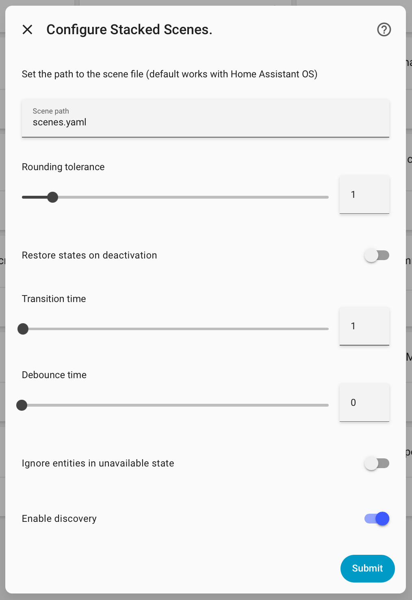

# Stacked Scenes
[](https://github.com/custom-components/hacs)


> Have you tried Stacked Scenes, but you have an open-plan area with entities that belong to multiple scenes and it doesn't quite work?

Stacked Scenes was built because although Stacked Scenes is awesome (this integration wouldn't exist without me trying that first), it just didn't work for my setup in a large multi-use open-plan family room. If you need to be able to use an entity in multiple scenes, have it work out what the state should be as those overlap and and turned on and off, this integration **might** help. If you don't need any of that, just use Stacked Scenes - really, its awesome!

> ***Note:*** *Stacked Scenes and Stacked Scenes won't play nice together, so just use one of the other. If you don have both added, Stacked Scenes will generate a Home Assistant Repair asking you to remove one of them, and then won't load any further to avoid any weird behaviour.


## Installation
### HACS
Install via [HACS](https://hacs.xyz) by searching for `Stacked Scenes` in the integrations section, or simply click the button:

[](https://my.home-assistant.io/redirect/hacs_repository/?owner=njlangley&repository=stacked_scenes&category=integration)

### Manual
Clone the repository and copy the custom_components folder to your home assistant config folder.

```bash
git clone https://github.com/njlangley/stacked_scenes.git
cp -r stacked_scenes/custom_components config/
```

## Configuration
This integration is now configured via the config flow. After you have installed and restarted Home Assistant, go to Devices and Services, Add Integration, and search for Stacked Scenes. Alternatively, just click this button:

[](https://my.home-assistant.io/redirect/integration/?domain=stacked_scenes)



### Scene path
If your configuration has a different location for scenes you can change the location by changing the `Scene path` variable. By default, Home Assistant places all scenes inside `scenes.yaml` which is where this integration retrieves the scenes.

### Rounding tolerance
Some attributes such as light brightness will be rounded off. Therefore, to assess whether the scene is active a tolerance will be applied. The default tolerance of 1 will work for rounding errors of ±1. If this does not work for your setup consider increasing this value.

### Restore on deactivation
You can set up Stacked Scenes to restore the state of the entities when you want to turn off a scene. This can also be configured per Stacked Scene by going to the device page.

### Transition time
Furthermore, you can specify the default transition time for applying scenes. This will gradually change the lights of a scene to the specified state. It does need to be supported by your lights.

### Debounce time

After activating a scene by turning on a stacked scene switch, entities may need some time to achieve their desired states. When first turned on, the scene state switch will be assumed to be 'on'; the debounce time setting controls how long this integration will wait after observing a member entity state update event before reevaluating the entity state to determine if the scene is still active. If you're having issues with scenes immediately deactivating/reactivating, consider increasing this debounce time.

This setting is measured in seconds, but sub-second values (e.g '0.1' for 100ms delay) can be provided such that the delay is not perceptible to humans viewing a dashboard, for example.

### Supported attributes
Note that while all entity states are supported only some entity attributes are supported at the moment. For the entities listed in the table the state is supported as well as the attributes in the table. Please open an issue, if you want support for other entity attributes.

| Entity Domain  | Attributes                               |
|----------------|------------------------------------------|
| `light`        | `brightness`, `rgb_color`, `effect`      |
| `cover`        | `position`                               |
| `media_player` | `volume_level`, `source`                 |
| `fan`          | `direction`, `oscillating`, `percentage` |


## Scene configurations
For each scene you can specify the individual transition time and whether to restore on deactivation by changing the variables on the scene's device page.

## HomeKit configuration
Once you have configured this integration, you can add the scenes to HomeKit. I assume that you already set up and configured the HomeKit integration. Expose the newly added switches to HomeKit. Then, in HomeKit define scenes for each Stacked Scenes switch.
